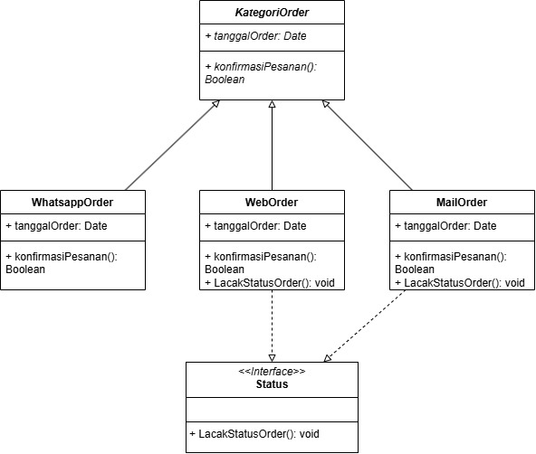

# SOAL QUIZ 2
---
## PRAKTIKUM PEMROGRAMAN BERBASIS OBJEK
### 1. Identifikasi penggunaan Abstract method dan Class berikut, jelaskan maksud dari class diagramnya dan buatlah kode programnya hingga pada demo untuk menampilkannya.

- Code pada folder Game

### 2. Seorang client Anda seorang Seller yang memiliki banyak media untuk menampung Order dari customer, Namun Seller ini kesulitan dalam membuat kategori Order, dia ingin setiap order wajib ada tanggal order dan wajib ada method konfirmasi setiap kategori yang dipisah menjadi 3 class: MailOrder, WebOrder, WhatsappOrder. Terdapat ontrak “pelacakan status order” pada pada class MailOrder dan WebOrder Bantu client Anda dengan menggambarkan class diagramnya yang mudah dia pahami!

- 

### 3. Berilah contoh kode program penggunaan konsep polymorphism (Heterogenous Collection, Object Casting, Polymorphic Arguments, InstanceOf) pada 1 tema(misalkan pilih 1 tema: kendaraan atau alat elektronik atau animal dst… Anda bisa membuat tema apa saja untuk menerapkan 4 point konsep polymorphism). Buatlah kode program java yang saling berkaitan. 
 
 - Code pada folder Polymorphism